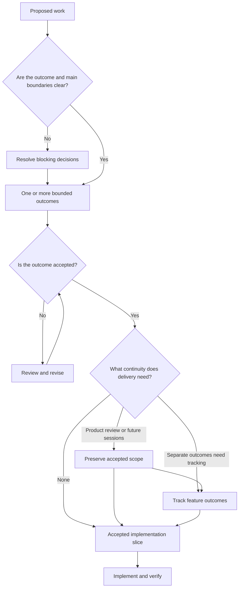

# SynoraStudio engineering playbook

This repository holds the engineering practice SynoraStudio uses across owned products and client projects.

The playbook has three layers:

- [Engineering Conventions](conventions/) define required outcomes for Professional Projects.
- [Workflows](workflows/) describe how recurring work moves through those conventions without depending on a particular agent.
- [Companion Skills](skills/) give coding agents portable, self-contained procedures for applying focused parts of the playbook.

Projects adopt the applicable convention baseline and translate it into their own Project Guardrails. Skills support that work, but installing or advertising a Skill is never a substitute for a project-owned control.

## Engineering conventions

- [Repositories](conventions/repositories.md): Make each repository's operating reality discoverable and locally owned.
- [Documentation](conventions/documentation.md): Keep durable knowledge current and in the artifact that owns it.
- [Architecture decisions](conventions/architecture-decisions.md): Preserve system boundaries and qualifying trade-off decisions.
- [Delivery](conventions/delivery.md): Move accepted scope to a verified, reviewable outcome.
- [Project guardrails](conventions/guardrails.md): Prevent or detect convention violations using controls suited to the project.

Conventions prescribe outcomes, applicability, evidence, and deviation boundaries. Their guardrail examples are non-binding; each project chooses controls that fit its architecture, risks, and tools.

## Workflows

- [Project intake](workflows/project-intake.md): Normalize an External Project Brief without turning upstream claims into accepted truth.
- [Project adoption](workflows/project-adoption.md): Audit an existing repository and apply approved changes for the current convention baseline.
- [Feature planning](workflows/feature-planning.md): Resolve uncertainty and establish accepted, bounded work without requiring every planning artifact.
- [Implementation](workflows/implementation.md): Deliver and verify an accepted slice while maintaining architecture, knowledge, and guardrails.

The main delivery route is based on the state of the work, not on which Skill happens to be available:



## Companion skills

The Skills mirror focused parts of the Workflows while remaining usable outside this repository:

- Project context and setup: `intake`, `init-agent-os`, and `adopt-project`.
- Feature planning: `map-decisions`, `grill`, `prototype`, `write-spec`, and `write-issues`.
- Implementation and continuity: `implement` and `handoff`.
- Durable knowledge: `maintain-language`, `write-adr`, and `maintain-living-docs`.

Each Skill lives in its own directory with a `SKILL.md`. Supporting references sit beside the Skill that owns them. One canonical copy supports Codex, Claude Code, and Cursor, with harmless client-specific metadata kept together where needed.

## Repository layout

```text
AGENTS.md
LANGUAGE.md
README.md
conventions/
  architecture-decisions.md
  delivery.md
  documentation.md
  guardrails.md
  repositories.md
workflows/
  feature-planning.md
  implementation.md
  project-adoption.md
  project-intake.md
docs/
  architecture.md
skills/
  ...
```

Add `templates/` only when a real shared template needs an owner.

## Repository checks

Install development dependencies with `npm ci`, then run `npm run lint:markdown`. GitHub Actions runs the same Markdown check on every pull request and on pushes to `main`.

## Adoption and change

Greenfield repositories start with the current applicable baseline. Existing repositories adopt or re-adopt it through an explicit audit and approved proposal. They do not copy the playbook, maintain a machine-readable convention manifest, or record a playbook version marker.

This repository uses the same conventions as guidance during ordinary maintenance, but it is not formally self-adopting. Add local guardrails here only when actual maintenance experience justifies them.

## Inspiration

The playbook draws inspiration from [Matt Pocock's AI skills repository](https://github.com/mattpocock/skills) and [Writing for Agents](https://www.aihero.dev/skills-writing-for-agents). SynoraStudio adapts those ideas into its own professional engineering practice.
