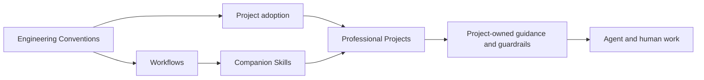

# Architecture

This repository is SynoraStudio's Engineering Playbook for owned products and client projects. Its architecture separates durable authority from agent execution procedures.

## Main parts

- `README.md` is the public navigation layer.
- `AGENTS.md` is the short operating entry point for agents maintaining this repository.
- `LANGUAGE.md` defines the playbook's bounded vocabulary.
- `conventions/` contains authoritative, agent-independent Engineering Conventions.
- `workflows/` contains agent-independent routes through recurring work.
- `skills/` contains portable companion procedures and their owned references.
- `docs/` contains durable explanations of this repository, including this architecture overview and any qualifying ADRs.
- `package.json`, `.markdownlint-cli2.jsonc`, and `commitlint.config.mjs` define the local checks.
- `.github/PULL_REQUEST_TEMPLATE.md` defines the repository's reviewable pull request structure and Macroscope summary placement.
- `.github/workflows/commitlint.yml` validates pull request titles as prospective squash commit messages.
- `.github/workflows/markdownlint.yml` runs the Markdown check on pull requests and pushes to `main`.
- `.macroscope/correctness/` supplies repository-specific context to Macroscope's built-in correctness review.
- `.macroscope/check-run-agents/` defines repository-specific semantic checks that import authoritative conventions rather than duplicating them.

`templates/` remains absent until a real shared template exists. The repository does not use a machine-readable convention or Skill manifest.

## Authority and flow

Engineering Conventions define required outcomes, evidence, and deviation boundaries. Workflows explain how work reaches those outcomes. Skills encode focused procedures for agents, but do not become the source of authority.

Professional Projects adopt the applicable baseline and translate it into local guidance and Project Guardrails. They do not copy central convention prose. Existing projects receive later convention changes only through explicit re-adoption, which audits actual state rather than comparing a stored playbook version.

## Portable Skills

Each Skill is self-contained enough to work after being copied or installed elsewhere. It may embed the outcomes and procedure it needs, but it must not require runtime access to files in `conventions/` or `workflows/`.

When an Engineering Convention or Workflow changes, its affected Skills are reviewed and updated in the same playbook change. This is repository maintenance, not a runtime dependency.

The Skills form a routing model rather than a mandatory sequence:

- `intake` supports Project Intake.
- `init-agent-os` initializes a greenfield repository; `adopt-project` applies Project Adoption to an existing one.
- `map-decisions`, `grill`, `prototype`, `write-spec`, and `write-issues` support Feature Planning.
- `implement` supports Implementation.
- `maintain-language`, `write-adr`, `maintain-living-docs`, and `handoff` maintain their owned knowledge or continuity artifacts when a Workflow needs them.

## Client compatibility

Each Skill has one canonical copy for Codex, Claude Code, and Cursor. Client-specific metadata may coexist when one client ignores another client's fields. Explicit-only Skills therefore keep `disable-model-invocation: true` in `SKILL.md` for Claude Code and Cursor alongside `policy.allow_implicit_invocation: false` in `agents/openai.yaml` for Codex.

Codex packaging is not a release target for this playbook. A strict Codex validator may reject the cross-client frontmatter flag even when Codex can still use the Skill. Treat that warning as an accepted compatibility trade-off. Revisit the metadata only if it blocks Skill loading or use in one of the three supported clients.

## Documentation boundaries

Artifact ownership is defined by the [Documentation convention](../conventions/documentation.md). This file stays navigational: it explains the playbook's current structure, authority flow, and Skill relationships without duplicating individual conventions or Workflow details.

Markdown linting checks repository documents locally and in GitHub Actions. Commitlint checks prospective squash messages against the Commit Convention. Macroscope's correctness review uses focused repository context, while its Commit Semantics check compares a pull request title with the full change.

Personal workflows belong to [`bjardon/personal-skills`](https://github.com/bjardon/personal-skills). They are outside SynoraStudio's professional engineering practice and this playbook's artifact model.
