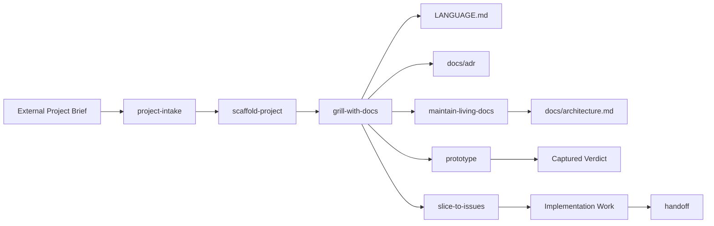

# Skills Repo Foundation

## Direction

Build this repo as an agent-agnostic personal skills library first, with Cursor-compatible `SKILL.md` frontmatter where useful. The repo should be portable across agents while still usable directly from Cursor.

Use Matt Pocock’s skills as inspiration, but adapt the model to your workflow:

- External project brief comes first from any source: Notion, markdown, pasted notes, links, or another skill.
- Grilling is the central workflow.
- Vocabulary lives in `LANGUAGE.md`, not `CONTEXT.md`.
- Durable decisions live in `docs/adr/`.
- Living documentation, including `docs/architecture.md`, is managed by a documentation stewardship skill.
- Features are shaped into smallest demoable vertical slices.
- Prototypes answer either logic/state or UI-variant questions, then get deleted or absorbed.

## Proposed Repo Shape

Create a simple first-wave structure:

```text
README.md
skills/
  project-intake/
    SKILL.md
  scaffold-project/
    SKILL.md
  grill-with-docs/
    SKILL.md
  write-language/
    SKILL.md
    LANGUAGE-FORMAT.md
  write-adr/
    SKILL.md
    ADR-FORMAT.md
  maintain-living-docs/
    SKILL.md
  slice-to-issues/
    SKILL.md
  prototype/
    SKILL.md
    LOGIC.md
    UI.md
  handoff/
    SKILL.md
```

The root `README.md` should explain the philosophy, repo layout, first-wave skills, and expected workflow.

## First-Wave Skill Boundaries

- `project-intake`: Normalize an external project brief into goals, users, constraints, feature candidates, assumptions, and open questions. Source-agnostic by design.
- `scaffold-project`: Create or adopt the common base folders and files for a project while staying tech-agnostic. Support two modes: new project mode creates the full base scaffold, and adopt existing project mode audits the repo, adds only missing pieces, preserves existing conventions, and never overwrites without asking. Default scaffold includes `AGENTS.md`, `LANGUAGE.md` / `LANGUAGE-MAP.md` when needed, `docs/adr/`, `docs/architecture.md`, canonical `plans/`, root `README.md` workflow sections, `.gitignore`, and `.editorconfig`. When used in Cursor, optionally create `.cursor/plans` as a symlink to `../plans` so Cursor workspace plans land in the canonical `plans/` directory. Windows portability is out of scope.
- `grill-with-docs`: Relentlessly interview and challenge the plan. Start collaborative, escalate when ambiguity or risk persists. Coordinate updates to language, ADRs, and living docs through the focused skills.
- `write-language`: Maintain scoped `LANGUAGE.md` files as bounded vocabulary only. Prevent glossary bloat with local language files and a promotion rule.
- `write-adr`: Create minimal ADRs only when a decision is hard to reverse, surprising without context, and the result of a real trade-off.
- `maintain-living-docs`: Steward durable docs such as `docs/architecture.md`, operational notes, onboarding notes, and project-specific docs. Route knowledge to the right artifact and avoid doc sprawl.
- `slice-to-issues`: Convert grilled features into smallest demoable vertical slices. Stay tracker-agnostic and ask where issues should live when needed.
- `prototype`: Build throwaway logic/state prototypes or UI variants. Preserve the answer, not the prototype.
- `handoff`: Produce compact session handoffs for future agents, referencing artifacts rather than duplicating them.

## Documentation Model

Adopt this artifact routing model:



`LANGUAGE.md` must remain a bounded glossary:

- Only project-specific vocabulary belongs there.
- Definitions stay short.
- Avoid implementation details, plans, decisions, and architecture notes.
- Use local `LANGUAGE.md` files for feature/module-specific vocabulary.
- Promote terms to root `LANGUAGE.md` only when multiple parts of the project need shared meaning.
- Use `LANGUAGE-MAP.md` only when multiple language contexts exist and need navigation.

## Project Scaffold Behavior

`scaffold-project` should establish the project operating system without resetting the repo.

In new project mode, it can create the full base structure.

In adopt existing project mode, it should:

- Detect existing docs, plans, ADRs, agent instructions, `.cursor/plans`, `.gitignore`, and `.editorconfig`.
- Preserve existing conventions unless they conflict with the desired operating model.
- Ask before renaming `CONTEXT.md` to `LANGUAGE.md` or introducing `LANGUAGE.md` alongside existing docs.
- Merge README workflow sections instead of replacing the README.
- Create `docs/architecture.md` only if there is no equivalent architecture overview.
- Create `.cursor/plans -> ../plans` only if `.cursor/plans` does not already contain unique files, or after migrating them with confirmation.
- Report what it added, skipped, and what still needs a decision.

## Autonomy Contract

Skills should encode a hybrid autonomy model:

- Agents can act autonomously inside an accepted slice.
- Agents must pause for product scope changes, hard-to-reverse architecture, paid services, data risk, large refactors, auth, or security-sensitive changes.
- Agents should document explicit assumptions when proceeding under uncertainty.

## Implementation Order

1. Establish the root README and folder conventions.
2. Author reusable reference formats: `LANGUAGE-FORMAT.md` and `ADR-FORMAT.md`.
3. Write the core orchestration skill: `grill-with-docs`.
4. Write support skills: `project-intake`, `scaffold-project`, `write-language`, `write-adr`, and `maintain-living-docs`.
5. Write execution-adjacent skills: `slice-to-issues`, `prototype`, and `handoff`.
6. Review all skill descriptions for clear trigger terms and agent-agnostic language.
7. Verify the first-wave skills are concise, composable, and do not duplicate responsibilities.

## Deferred Skills

After the first wave works in real projects, consider adding:

- `improve-architecture`
- `implement-slice`
- `review-slice`
- `ship-check`
- `docs-polish`