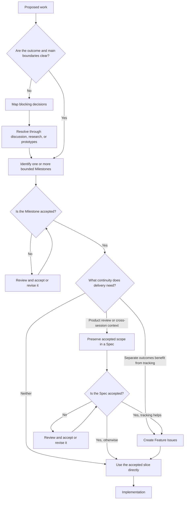

# Feature planning workflow

Feature Planning turns proposed work into one or more accepted, bounded outcomes. It is a routing Workflow, not a mandatory document pipeline.

## Route by current state

## Planning rules

- A Decision Map organizes uncertainty only when dependent decisions or Milestone boundaries are unclear.
- A Decision Issue owns one substantial unresolved question when it needs separate discussion, research, or a Prototype.
- A Grilling Session resolves branches in a concrete design; it does not replace broad intake or implementation.
- A Prototype is throwaway code that answers one design question before production commitment.
- A Spec preserves already-settled scope when product review or cross-session continuity warrants it. It remains a draft until accepted.
- Feature Issues represent user-recognizable or system-owner-visible outcomes, not technical implementation tasks.
- Optional artifacts are omitted when they solve no visible problem.
- Hard-to-reverse architecture choices follow the [Architecture decisions convention](../conventions/architecture-decisions.md).

## Completion

Planning is complete for a slice when its observable outcome and material boundaries are accepted, blocking decisions are resolved or excluded, and any needed continuity artifact exists. The result enters the [Implementation Workflow](implementation.md).

Companion Skills support individual routes: `map-decisions`, `grill`, `prototype`, `write-spec`, and `write-issues`.
