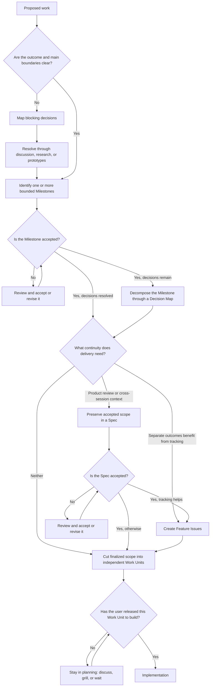

# Feature planning workflow

Feature Planning turns proposed work into one or more accepted, bounded outcomes. It is a routing Workflow, not a mandatory document pipeline.

## Default posture

Planning is the default mode for new or unclear work, and it is collaborative. The agent's job here is to develop the outcome with the user through conversation: product behavior and constraints, technical approach, and third-party dependencies and providers. Reach for `grill` when a branch runs deep enough to need a decision-by-decision interview.

Do not implement from this Workflow. Planning ends by producing finalized scope and cutting it into independent Work Units; a Work Unit becomes buildable only when the user releases it, which enters the [Implementation Workflow](implementation.md). Proposing scope, writing a Spec, or accepting scope is not a release, and the agent never treats its own proposal as one.

## Route by current state

## Planning rules

- A Decision Map organizes the dependent decisions in a body of work, either to discover Milestone boundaries when the shape is unclear or to decompose an accepted Milestone that still holds unresolved decisions.
- A Decision Issue owns one substantial unresolved question when it needs separate discussion, research, or a Prototype.
- A Grilling Session resolves branches in a concrete design; it does not replace broad intake or implementation.
- A Prototype is throwaway code that answers one design question before production commitment.
- A Spec preserves already-settled scope when product review or cross-session continuity warrants it. It remains a draft until accepted.
- Feature Issues represent user-recognizable or system-owner-visible outcomes cut as vertical slices, not technical implementation tasks or horizontal layers. They nest shallowly, the way a Decision Map nests.
- Optional artifacts are omitted when they solve no visible problem.
- Hard-to-reverse architecture choices follow the [Architecture decisions convention](../conventions/architecture-decisions.md).

## Completion

Planning is complete for a Work Unit when its observable outcome and material boundaries are accepted, blocking decisions are resolved or excluded, any needed continuity artifact exists, and the finalized scope has been cut into independent Work Units. A finalized, accepted plan is not yet a build authorization: each Work Unit enters the [Implementation Workflow](implementation.md) only when the user releases it, and unreleased units stay in planning.

Companion Skills support individual routes: `map-decisions`, `grill`, `prototype`, `write-spec`, and `write-issues`.
